# 🛒 TechShop — Hệ thống bán lẻ thiết bị công nghệ trực tuyến

TechShop là website thương mại điện tử chuyên bán các thiết bị công nghệ như laptop, điện thoại, máy tính bảng. Hệ thống cung cấp giao diện mua sắm trực quan cho khách hàng và bảng quản trị đầy đủ cho Admin, được xây dựng theo kiến trúc REST API với ReactJS và Spring Boot.

---

## 📋 Mô tả ứng dụng

**TechShop** là nền tảng mua sắm thiết bị công nghệ trực tuyến theo mô hình B2C, cho phép khách hàng dễ dàng tìm kiếm, xem thông tin chi tiết và đặt mua sản phẩm. Hệ thống tích hợp đánh giá sản phẩm thực tế, giỏ hàng lưu trữ cục bộ và quy trình đặt hàng COD đơn giản. Phía Admin có đầy đủ công cụ quản lý sản phẩm, danh mục, đơn hàng và người dùng.

---

## 🎬 Video Demo

> Xem video demo đầy đủ các tính năng của TechShop tại link bên dưới:

[](https://drive.google.com)

---

## 🖼️ Giao diện hệ thống

### 1. Trang chủ
> Hero banner với slider sản phẩm tự động chuyển mỗi 3.5 giây, khu vực
> 4 cam kết (miễn phí ship, bảo hành, giao hàng nhanh, hỗ trợ 24/7),
> danh mục sản phẩm và sản phẩm nổi bật với rating thật từ cơ sở dữ liệu.

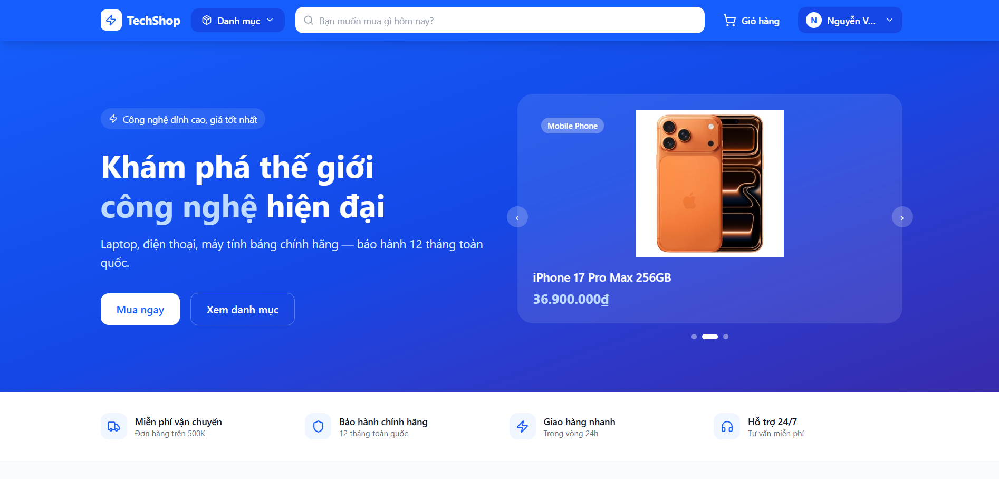

---

### 2. Đăng nhập
> Giao diện 2 cột. Cột trái giới thiệu thương hiệu với các cam kết nổi
> bật. Cột phải là form đăng nhập gồm email, mật khẩu với nút ẩn/hiện
> mật khẩu. Hiển thị thông báo lỗi inline khi sai thông tin.

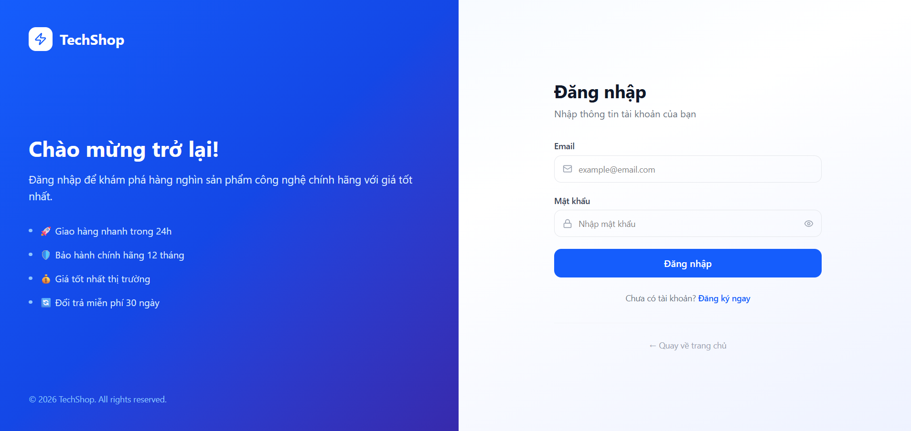

---

### 3. Đăng ký
> Giao diện 2 cột tương tự đăng nhập. Form gồm họ tên, email, mật khẩu
> và số điện thoại. Có thanh hiển thị độ mạnh mật khẩu realtime (Yếu /
> Trung bình / Mạnh) và thông báo lỗi inline khi email đã tồn tại.


---

### 4. Danh sách sản phẩm
> Bố cục 2 phần. Sidebar trái gồm danh mục sản phẩm (kèm số lượng SP
> từng danh mục) và tùy chọn sắp xếp (mặc định, giá tăng, giá giảm,
> tên A-Z). Khu vực phải là grid sản phẩm với card hiển thị hình ảnh,
> tên, rating thật và giá.

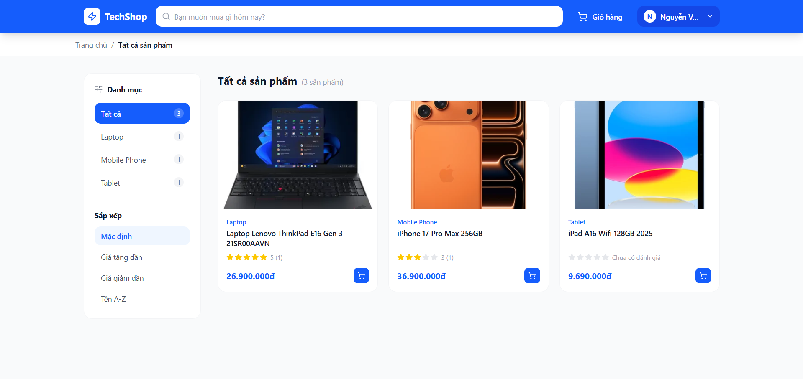

---

### 5. Chi tiết sản phẩm
> Gồm các khu vực: gallery nhiều ảnh với thumbnail bên dưới, thông tin
> sản phẩm (tên, rating, giá, tồn kho, thông số nổi bật, bộ chọn số
> lượng, nút thêm giỏ hàng và mua ngay), bảng thông số kỹ thuật đầy đủ,
> mô tả sản phẩm, sản phẩm liên quan cùng danh mục và khu vực đánh giá.

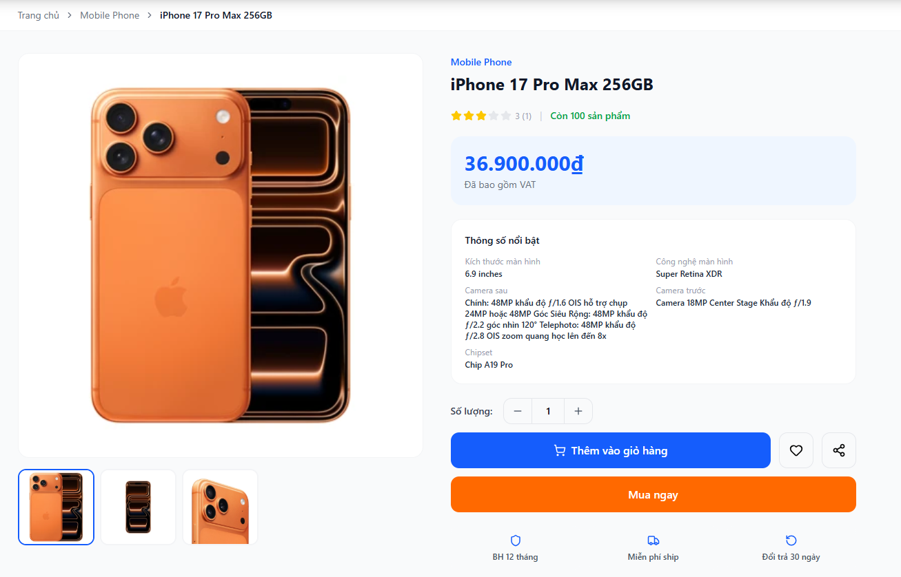

---

### 6. Giỏ hàng
> Bố cục 2 phần. Danh sách sản phẩm bên trái hiển thị hình ảnh, tên,
> danh mục, bộ tăng giảm số lượng, nút xóa và thành tiền từng sản phẩm.
> Tóm tắt đơn hàng bên phải hiển thị tạm tính, phí ship (miễn phí đơn
> trên 500K) và tổng cộng.

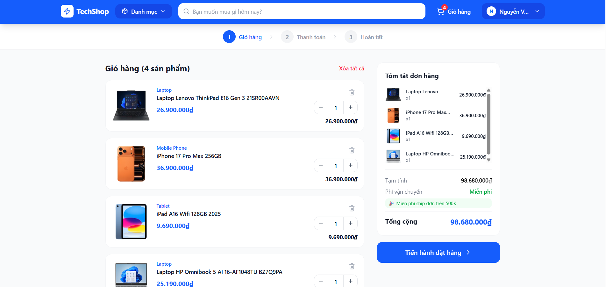

---

### 7. Đặt hàng
> Form nhập thông tin giao hàng gồm họ tên người nhận, số điện thoại,
> địa chỉ và ghi chú. Phía dưới là phần chọn phương thức thanh toán
> (COD). Bên phải là tóm tắt đơn hàng với danh sách sản phẩm thu gọn
> và tổng tiền. Sau khi xác nhận hiển thị màn hình đặt hàng thành công.

| Nhập thông tin | Thành công |
|---|---|
| 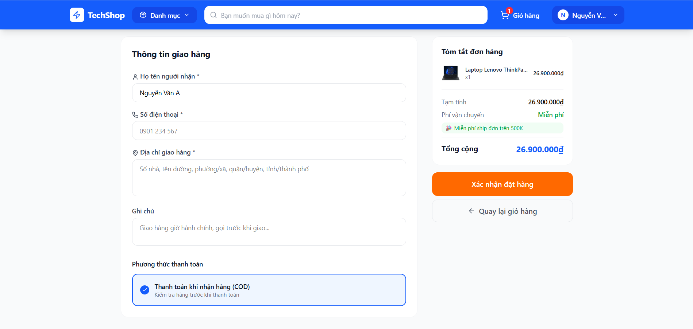 | 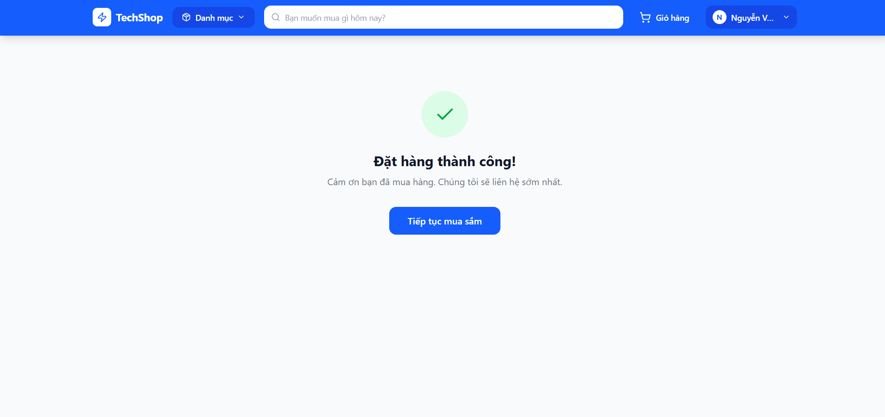 |

---

### 8. Đơn hàng của tôi
> Phía trên có các tab lọc theo trạng thái: Tất cả, Chờ xác nhận, Đã
> xác nhận, Đang giao, Đã giao, Đã hủy (kèm số lượng mỗi tab). Mỗi
> đơn hàng hiển thị mã đơn, thời gian, trạng thái (badge màu), danh
> sách sản phẩm kèm ảnh, địa chỉ giao hàng và tổng tiền. Đơn hàng
> Chờ xác nhận có thêm nút Hủy đơn hàng.

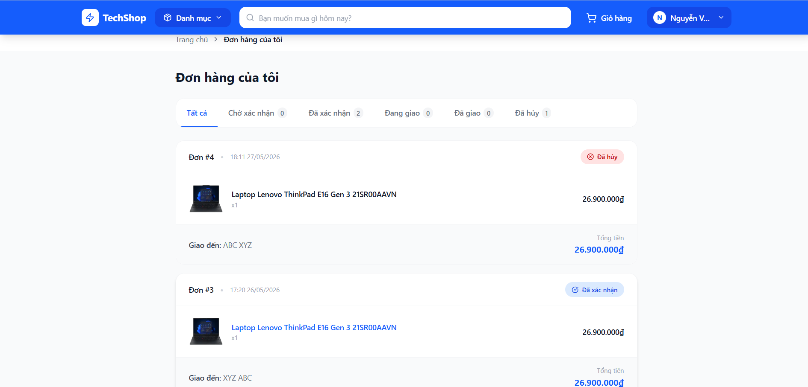

---

### 9. Đánh giá sản phẩm
> Nằm trong trang chi tiết sản phẩm. Phần trên hiển thị điểm trung bình
> kèm tổng số đánh giá. Form đánh giá gồm bộ chọn sao 1-5 (hover hiện
> nhãn: Rất tệ / Tệ / Bình thường / Tốt / Xuất sắc) và ô nhập nhận xét.
> Danh sách đánh giá hiển thị avatar, tên, ngày và số sao của từng người.
> Mỗi người chỉ đánh giá một sản phẩm một lần.

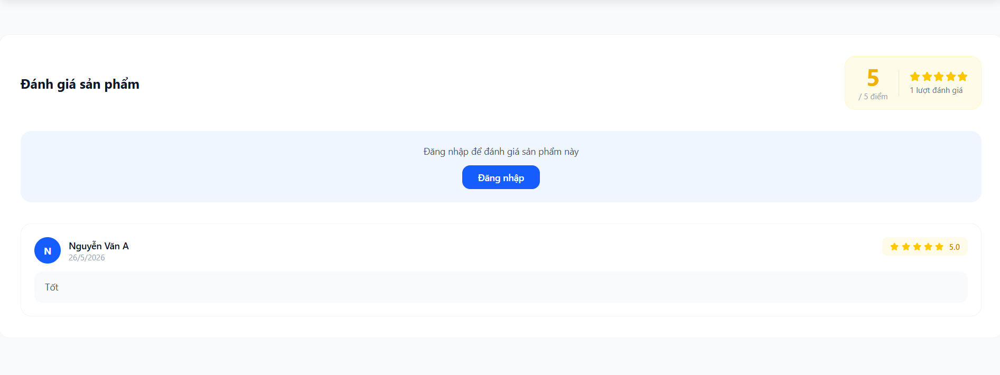

---

### 10. Thông tin cá nhân
> Header hiển thị avatar chữ cái, họ tên và email. Sidebar trái có 3
> tab điều hướng. Tab Thông tin: cập nhật họ tên, số điện thoại, địa
> chỉ (email chỉ đọc). Tab Đổi mật khẩu: nhập mật khẩu hiện tại, mật
> khẩu mới và xác nhận (có nút ẩn/hiện). Tab Đơn hàng: hiển thị 5 đơn
> hàng gần nhất kèm nút Xem tất cả.

Thông tin:
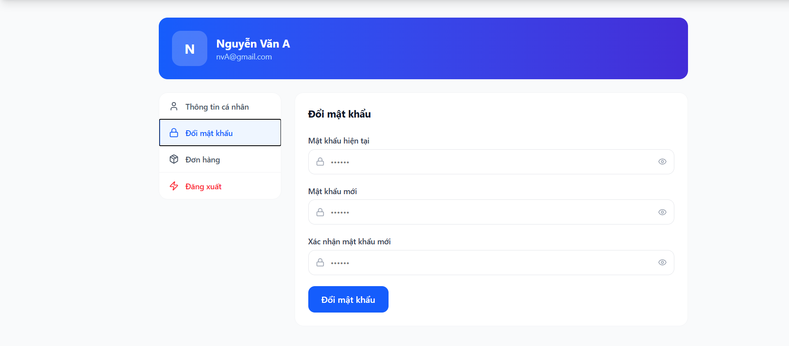

Đổi mật khẩu:
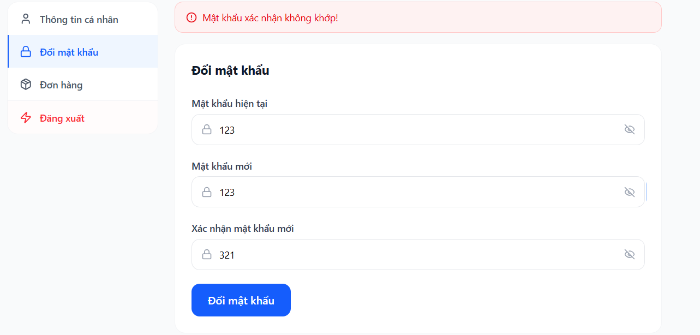

Đơn hàng gần đây:
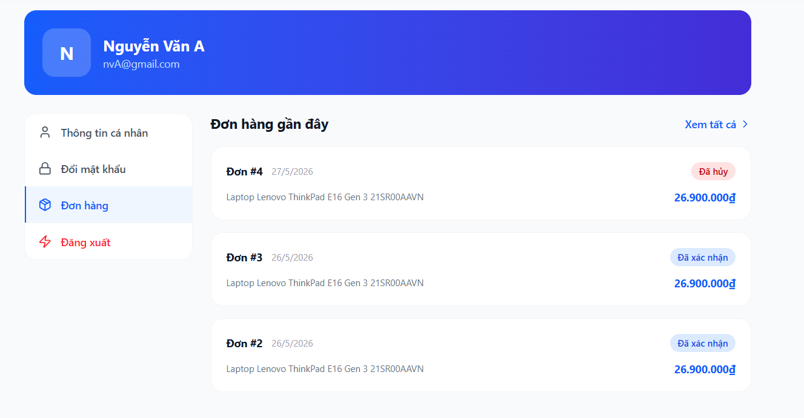

---

### 11. Admin Dashboard
> Sidebar trái gồm logo, các mục Tổng quan, Sản phẩm, Đơn hàng, Người
> dùng và thông tin tài khoản Admin. Khu vực chính hiển thị 4 thẻ thống
> kê: tổng số sản phẩm, danh mục, đơn hàng và người dùng.

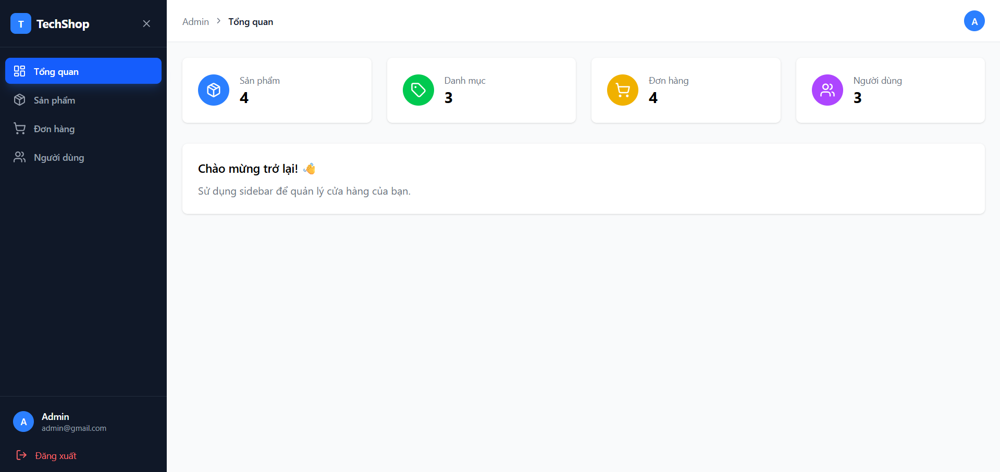

---

### 12. Quản lý sản phẩm
> Grid sản phẩm với thanh tìm kiếm và nút lọc theo danh mục phía trên.
> Mỗi thẻ sản phẩm hiển thị ảnh, tên, danh mục, giá, tồn kho và 2 nút
> Sửa / Xóa. Góc trên phải có nút Thêm sản phẩm. Tab Danh mục ở phía
> trên để chuyển sang quản lý danh mục.

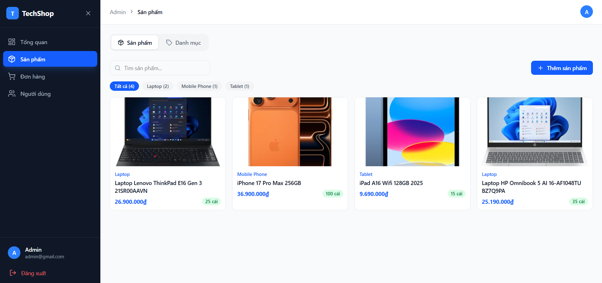

---

### 13. Thêm sản phẩm
> Form gồm: tên sản phẩm, chọn danh mục, giá bán, số lượng tồn kho,
> mô tả. Khu vực upload ảnh hỗ trợ nhiều ảnh, kéo thả hoặc nhấn chọn.
> Phần thông số kỹ thuật cho phép thêm nhiều cặp tên-giá trị động (có
> nút thêm dòng và xóa từng dòng).

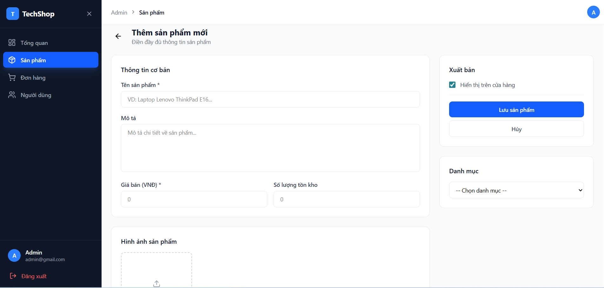

---

### 14. Sửa sản phẩm
> Giao diện tương tự Thêm sản phẩm nhưng các trường được điền sẵn
> thông tin hiện tại. Hiển thị ảnh đã upload với nút xóa từng ảnh và
> có thể upload thêm ảnh mới. Thông số kỹ thuật hiển thị sẵn và có thể
> chỉnh sửa hoặc thêm mới.

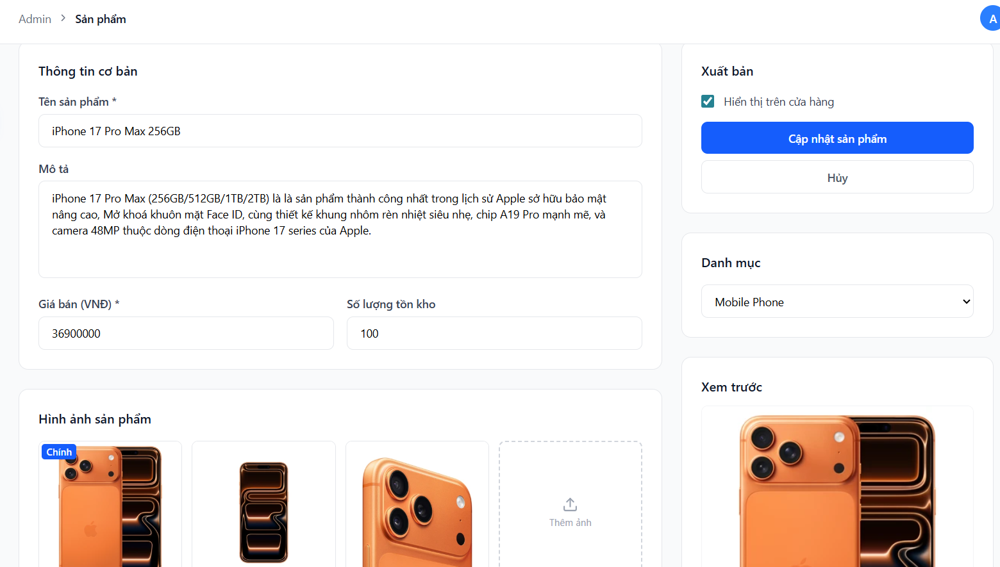

---

### 15. Quản lý danh mục
> Bảng danh sách danh mục với tên và mô tả. Form thêm danh mục nhanh
> ngay trên trang gồm ô nhập tên và mô tả. Mỗi danh mục có 2 nút
> Sửa (mở form chỉnh sửa inline) và Xóa (có xác nhận trước khi xóa).

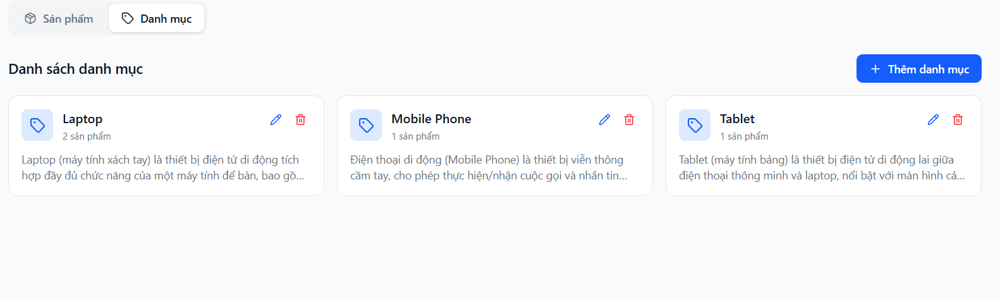

---

### 16. Quản lý đơn hàng
> Phía trên có 5 thẻ thống kê số lượng theo trạng thái (nhấn để lọc).
> Thanh tab và ô tìm kiếm theo mã đơn hoặc địa chỉ. Bảng gồm các cột:
> mã đơn + ngày đặt, sản phẩm kèm ảnh, thông tin khách hàng (tên +
> email), địa chỉ giao hàng, tổng tiền, badge trạng thái và dropdown
> cập nhật trạng thái. Đơn đã giao/đã hủy thì dropdown bị vô hiệu hóa.

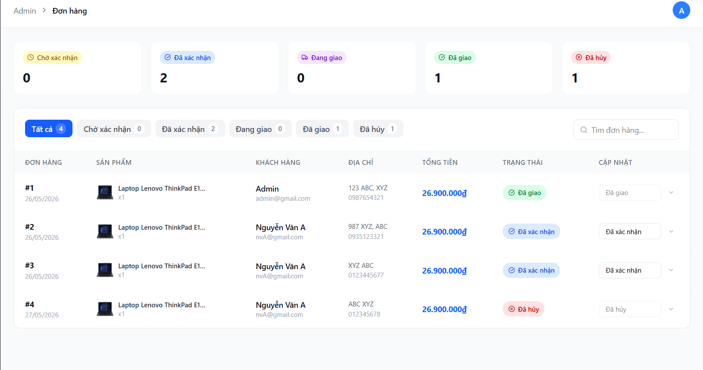

---

### 17. Quản lý người dùng
> Phía trên có 3 thẻ thống kê: tổng người dùng, khách hàng và Admin.
> Tabs lọc theo vai trò (Tất cả / Khách hàng / Admin) và ô tìm kiếm
> theo tên hoặc email. Bảng gồm avatar chữ cái + họ tên + ID, email,
> số điện thoại, badge vai trò (Admin màu tím / Khách hàng màu xanh)
> và badge trạng thái (Hoạt động màu xanh lá / Bị khóa màu đỏ).

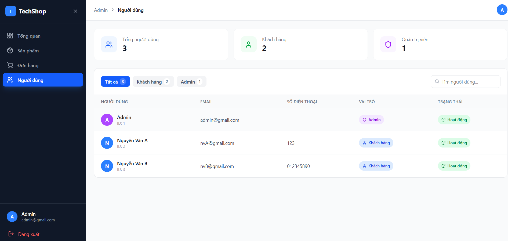

---

## 🏗️ Kiến trúc hệ thống

Dự án được thiết kế theo kiến trúc **Client-Server** với **REST API**, tách biệt hoàn toàn Frontend và Backend.

```
+-------------------------------------------------------+
|               Trình duyệt / Người dùng                |
+---------------------------+---------------------------+
                            |
              HTTP Request  |  HTTP Response
          (JSON, FormData)  |  (JSON)
                            v
+-------------------------------------------------------+
|          FRONTEND (REACT + VITE — PORT 5173)          |
|  - ReactJS + React Router (Điều hướng SPA)            |
|  - Tailwind CSS (Giao diện)                           |
|  - Zustand (Quản lý state: Auth, Cart)                |
|  - Axios + Interceptor (Gọi API + gắn JWT tự động)    |
+---------------------------+---------------------------+
                            |
              REST API Call | JSON Response
              Bearer Token  |
                            v
+-------------------------------------------------------+
|          BỘ LỌC BẢO MẬT (SPRING SECURITY)             |
|  - JWT Authentication                                 |
|  - JwtFilter — Xác thực mỗi request                   |
|  - CORS Configuration                                 |
+---------------------------+---------------------------+
                            |
                            v
+-------------------------------------------------------+
|        BACKEND (SPRING BOOT — PORT 8080)              |
|  - AuthController      - ProductController            |
|  - CategoryController  - OrderController              |
|  - ReviewController    - UserController               |
+---------------------------+---------------------------+
                            |
                            v
+-------------------------------------------------------+
|           TẦNG NGHIỆP VỤ (SERVICE / REPOSITORY)       |
|  - Spring Data JPA + Hibernate                        |
|  - BCrypt Password Encoding                           |
|  - JWT Token Generation & Validation                  |
+---------------------------+---------------------------+
                            |
                            v
+-------------------------------------------------------+
|              CƠ SỞ DỮ LIỆU (MYSQL)                    |
|  - users, categories, products, product_images        |
|  - product_specs, orders, order_items, reviews        |
+-------------------------------------------------------+
```

---

## 🛠️ Công nghệ sử dụng

| Thành phần | Công nghệ |
|---|---|
| **Frontend** | ReactJS, Vite, Tailwind CSS, React Router |
| **State Management** | Zustand (Auth Store, Cart Store) |
| **HTTP Client** | Axios + Interceptor |
| **Backend** | Java 21, Spring Boot, Spring Security |
| **Xác thực** | JSON Web Token (JWT) |
| **Database** | MySQL, Spring Data JPA, Hibernate |
| **Công cụ** | VS Code, IntelliJ IDEA, XAMPP, Postman |

---

## ✨ Các chức năng chính

### 🔐 Xác thực (Authentication)
- Đăng ký tài khoản với validation đầy đủ và thanh độ mạnh mật khẩu
- Đăng nhập bảo mật bằng JWT Token lưu trong localStorage
- Mật khẩu mã hóa bằng BCrypt
- Phân quyền CUSTOMER / ADMIN

### 🛍️ Mua sắm
- Xem danh sách sản phẩm với lọc theo danh mục và sắp xếp theo giá
- Tìm kiếm sản phẩm realtime theo tên
- Xem chi tiết sản phẩm với gallery nhiều ảnh và thông số kỹ thuật
- Thêm vào giỏ hàng lưu localStorage qua Zustand
- Đặt hàng COD với form thông tin giao hàng

### 📦 Quản lý đơn hàng
- Xem lịch sử đơn hàng với lọc theo 5 trạng thái
- Hủy đơn hàng khi đang chờ xác nhận
- Theo dõi trạng thái: Chờ xác nhận → Đã xác nhận → Đang giao → Đã giao

### ⭐ Đánh giá sản phẩm
- Đánh giá sao từ 1-5 kèm nội dung nhận xét
- Mỗi khách hàng chỉ đánh giá một sản phẩm một lần
- Rating trung bình cập nhật realtime và hiển thị trên card sản phẩm

### 👤 Thông tin cá nhân
- Xem và cập nhật họ tên, số điện thoại, địa chỉ
- Đổi mật khẩu với xác thực mật khẩu hiện tại
- Xem đơn hàng gần đây

### 🔧 Quản trị (Admin)
- Dashboard thống kê tổng quan
- Quản lý sản phẩm: thêm/sửa/xóa, upload nhiều ảnh, thêm thông số kỹ thuật động
- Quản lý danh mục: thêm/sửa/xóa danh mục
- Quản lý đơn hàng: xem thông tin khách hàng, cập nhật trạng thái trực tiếp
- Quản lý người dùng: xem danh sách, lọc theo role, tìm kiếm

---

## 📁 Cấu trúc thư mục dự án

```
DoAnPTWeb/
├── frontend/                            # React + Vite (port 5173)
│   └── src/
│       ├── api/
│       │   ├── axiosConfig.js           # Interceptor JWT tự động
│       │   └── productApi.js            # API lấy thống kê rating
│       ├── components/
│       │   ├── customer/
│       │   │   ├── Navbar.jsx           # Thanh điều hướng + giỏ hàng badge
│       │   │   ├── Footer.jsx           # Footer dùng chung
│       │   │   ├── ProductCard.jsx      # Card sản phẩm + rating thật
│       │   │   └── StarRating.jsx       # Component hiển thị sao
│       │   └── admin/
│       │       └── AdminLayout.jsx      # Layout sidebar Admin
│       ├── pages/
│       │   ├── customer/
│       │   │   ├── Home.jsx             # Trang chủ + slider
│       │   │   ├── ProductList.jsx      # Danh sách + filter sidebar
│       │   │   ├── ProductDetail.jsx    # Chi tiết + gallery + đánh giá
│       │   │   ├── Cart.jsx             # Giỏ hàng + đặt hàng
│       │   │   ├── Orders.jsx           # Lịch sử đơn hàng
│       │   │   ├── Profile.jsx          # Thông tin cá nhân
│       │   │   ├── Login.jsx            # Đăng nhập
│       │   │   └── Register.jsx         # Đăng ký
│       │   └── admin/
│       │       ├── Dashboard.jsx        # Thống kê tổng quan
│       │       ├── Products.jsx         # Quản lý sản phẩm + danh mục
│       │       ├── CreateProduct.jsx    # Thêm sản phẩm
│       │       ├── EditProduct.jsx      # Sửa sản phẩm
│       │       ├── Orders.jsx           # Quản lý đơn hàng
│       │       └── Users.jsx            # Quản lý người dùng
│       ├── store/
│       │   ├── authStore.js             # Zustand: thông tin đăng nhập
│       │   └── cartStore.js             # Zustand: giỏ hàng
│       └── utils/
│           ├── constants.js             # STATUS_CONFIG, STATUS_OPTIONS
│           └── formatters.js            # formatPrice, formatDate
│
└── backend/                             # Spring Boot (port 8080)
    └── src/main/java/
        ├── controller/
        │   ├── AuthController.java      # Đăng ký, Đăng nhập
        │   ├── ProductController.java   # CRUD sản phẩm + upload ảnh
        │   ├── CategoryController.java  # CRUD danh mục
        │   ├── OrderController.java     # Đặt hàng, xem, cập nhật
        │   ├── ReviewController.java    # Đánh giá sản phẩm
        │   └── UserController.java      # Thông tin người dùng
        ├── entity/
        │   ├── User.java
        │   ├── Category.java
        │   ├── Product.java
        │   ├── ProductImage.java
        │   ├── ProductSpec.java
        │   ├── Order.java
        │   ├── OrderItem.java
        │   └── Review.java
        ├── repository/                  # 8 JPA Repositories
        ├── config/
        │   ├── SecurityConfig.java      # Spring Security + CORS
        │   ├── JwtFilter.java           # Xác thực JWT mỗi request
        │   └── JwtUtil.java             # Generate & Validate JWT
        └── resources/
            └── application.properties
```

---

## 🚀 Hướng dẫn chạy dự án

### 🛠️ Yêu cầu chuẩn bị

- **Java JDK 21** trở lên
- **Node.js 20.x** trở lên
- **XAMPP** (MySQL đang chạy)
- **IntelliJ IDEA** hoặc **VS Code**
- **Postman** (tuỳ chọn — kiểm thử API)

---

### 🗄️ Bước 1: Cấu hình cơ sở dữ liệu

Mở phpMyAdmin (`http://localhost/phpmyadmin`) và tạo database:

```sql
CREATE DATABASE doanptweb
CHARACTER SET utf8mb4
COLLATE utf8mb4_unicode_ci;
```

Import file SQL có sẵn trong thư mục dự án:

- Chọn database `doanptweb` vừa tạo
- Vào tab **Import**
- Chọn file `doanptweb.sql` trong thư mục gốc của dự án
- Nhấn **Go** để import

Cấu hình `backend/src/main/resources/application.properties`:

```properties
spring.datasource.url=jdbc:mysql://localhost:3306/doanptweb?useSSL=false&serverTimezone=UTC&allowPublicKeyRetrieval=true
spring.datasource.username=root
spring.datasource.password=

spring.jpa.hibernate.ddl-auto=update
spring.jpa.show-sql=true

server.port=8080
```

---

### ⚙️ Bước 2: Chạy Backend (Spring Boot)

```bash
cd backend
./mvnw spring-boot:run
```

Hoặc mở IntelliJ IDEA → Run `BackendApplication.java`

Console hiện thông báo thành công:
```
Started BackendApplication in X seconds
```

---

### 💻 Bước 3: Chạy Frontend (React)

```bash
cd frontend
npm install
npm run dev
```

---

### 🌐 Bước 4: Truy cập ứng dụng

| Địa chỉ | Mô tả |
|---|---|
| `http://localhost:5173` | Giao diện khách hàng |
| `http://localhost:5173/admin` | Giao diện Admin |
| `http://localhost:8080/api` | REST API Backend |

Đăng ký tài khoản mới tại `/register` hoặc tạo tài khoản Admin trực tiếp trong database:

```sql
-- Sau khi đăng ký tài khoản bình thường, cập nhật role thành ADMIN:
UPDATE users SET role = 'ADMIN' WHERE email = 'your@email.com';
```

---

## 👨‍💻 Thông tin đồ án

| Thông tin | Chi tiết |
|---|---|
| **Môn học** | Phát triển ứng dụng Web |
| **Trường** | Đại học Nha Trang |
| **Khoa** | Công nghệ Thông tin |
| **GVHD** | ThS. Mai Cường Thọ |
| **Sinh viên** | Nguyễn Phúc Tâm Huy |
| **MSSV** | 65131313 |
| **Năm** | 2026 |
